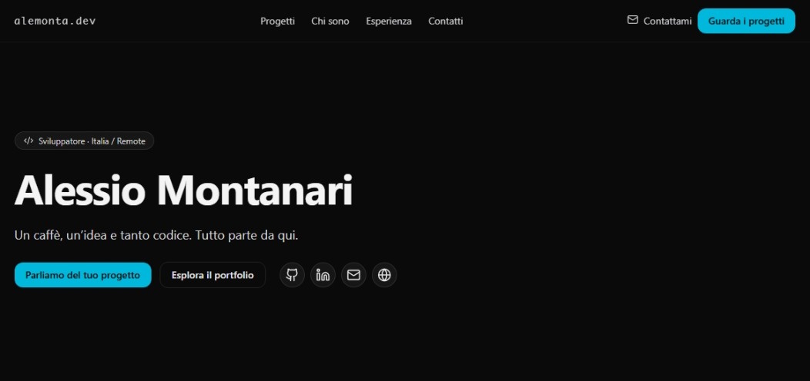

# alemonta.dev — Portfolio di Alessio Montanari

Sito personale e portfolio digitale sviluppato in **React + TypeScript**, con un design **minimalista, tecnico e curato nei dettagli**.  



---

## ⚙️ Setup e avvio locale

> Requisiti: Node.js ≥ 18 e npm o pnpm

```bash
# Clona il repository
git clone https://git.alemonta.dev/alemontamd5/portfolio-alemonta.git
cd alemonta.dev

# Installa le dipendenze
npm install
# oppure
pnpm install

# Avvia il server di sviluppo
npm run dev
```
